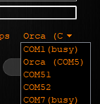
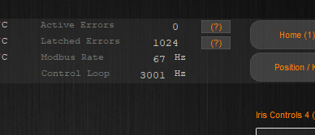
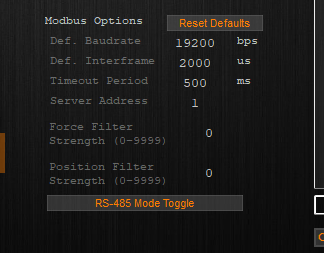
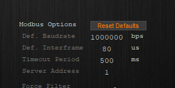

# 09 - High Speed Communication

In this tutorial, we will show how to configure your Orca motor and your code in order to achieve high communication rates.
  
---

We begin with the source code from tutorial 1:

```./main.cpp
#include <iostream>
#include "actuator.h"
#include "TutorialHelpers.h"

using namespace orcaSDK;

int main() {
	Actuator motor{ "MyMotorName" };

	int serial_port = obtain_serial_port_number();

	motor.open_serial_port(serial_port);
	
	while (true)
	{
		std::cout << "Current Position: " << motor.get_position_um().value << "          \r";
	}

	return 0;
}
```

## Viewing Communication Rate

For this tutorial we'll be using IrisControls to access the motor's build in GUI both to view its performance and to configure it as we'd like. First download IrisControls from [our downloads page](https://irisdynamics.com/downloads) and install it. Once it's installed, try opening it. You'll need your Orca to be connected to your computer through a blue rs485 cable in order to do this. Select that rs485 cable from IrisControls' dropdown menu above the connect button.



Once connected. Try running your code from Tutorial 1. Look in the status bar at the top of your connected IrisControls window. The "Modbus Rate" parameter should be reading somewhere between 40-70 Hz. 



This is your communication rate, how many messages are going from your application to your motor and back within a second. 

## Configure Your Communication Parameters Through IrisControls

The parameters that we'll need to update to allow for higher communication rates can be found on the modbus page. Select the button titled "Modbus". We're looking for the parameters "Def. Baudrate" and "Def. Interframe", which can be found in the section "Modbus Options". 



The Baudrate parameter determines the Baud Rate for the motor. It determines how rapidly the motor will transmit signals, or bits. A higher number here increases the rate of communication. The Interframe parameter determines how long the motor will wait at a minimum before returning a response. A lower number here will increase the rate of communication. We'll update the parameters to 1000000bps baudrate and 80us interframe.



## Configure Your Communication Parameters in the Code

We can't simply update the parameters in the motor and expect communication to work. An important feature of baud rate in particular, is that not only does it influence how rapidly the transmitter sends signals, it also influences how rapidly the receiver expects signals. This is to say that the code should have matching parameters to your motor's configurations. These parameters are added during your call to Actuator::open_serial_port().

``` ./main.cpp
	...
	motor.open_serial_port(serial_port, 1000000, 80);
	...
```

At this point your configurations should match. Try running the code again. If everything is working well, your new communication rate should be somewhere close to 1000Hz.