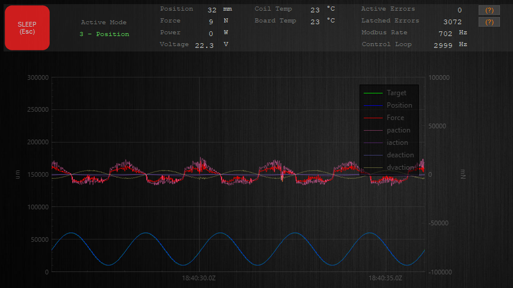

# 10 - High Speed Position Control

High speed communication is beneficial when real-time feedback or smooth motion is critical, and when large volumes of data need to be streamed from the motor. This tutorial illustrates an application of high speed communication using position control, which outputs a sine wave. 

## Prerequisites
 - [Tutorial 06 - Command Stream](../06_CommandStream/06_CommandStream.md)
 - [Tutorial 09 - High Speed Communication](../09_HighSpeedCommunication/09_HighSpeedCommunication.md)
  
  
---

We will begin with the source code from the previous tutorial, adding command streaming, so data can be sent and received asynchronously at a high-rate:

```./main.cpp
#include <iostream>
#include "actuator.h"
#include "TutorialHelpers.h"

using namespace orcaSDK;

int main() {
	Actuator motor{ "MyMotorName" };

	int serial_port = obtain_serial_port_number();

	motor.open_serial_port(serial_port, 1000000, 80);

	motor.enable_stream();
	
	while (true)
	{
		motor.run();

		std::cout << "Current Position: " << motor.stream_cache.position << "          \r";
	}

	return 0;
}
```

## High Speed Position Control Setup

We will be outputting a sine wave using position mode, by streaming data to and from the motor.

First, set the motor to sleep mode. This will reset any errors, if encountered, during the motor's last run. We will set this after opening the serial port and setting the communication rate. 

``` ./main.cpp
	motor.open_serial_port(serial_port, 1000000, 80);

	motor.set_mode(MotorMode::SleepMode);     
```

Next, set the motor to position mode and declare a timer object, this will be used as part of the calculation which sets the movement interval of the sine wave.

``` ./main.cpp
	motor.set_mode(MotorMode::SleepMode); 

	motor.enable_stream();

	motor.set_mode(MotorMode::PositionMode);

	Timer sine_wave_timer;    
```

## Creating a Sine Wave

Now we will now add a function which multiples the time from the timer object, by two and pi. This function's result is cast to an int, as `set_streamed_position()` requires an int argument to set the motor's position. 

Note: importing `<cmath>` is required to use `M_PI`. If using Visual Studio including `#define _USE_MATH_DEFINES`, is also required at the beginning of your source file. 

The constants used in this function are added below the file imports.

If using Visual Studio, the beginning of your main file will look like:

``` ./main.cpp
	#define _USE_MATH_DEFINES
	#include <iostream>
	#include "actuator.h"
	#include "tools/timer.h"
	#include "TutorialHelpers.h"
	#include <cmath> 

	const int sine_offset = 35000;
	const int amplitude = 25000;
	const float frequency = 0.5;
	const float milliseconds_to_seconds = 1000.0;

	static int get_sine_target_(const float time_elapsed)
	{
		double two_pi_ft = 2 * M_PI * frequency * time_elapsed;
		double position_target = (amplitude * sin(two_pi_ft)) + sine_offset;
		return static_cast<int>(position_target);
	} 
```

## Streaming Positions to the Motor

As in [Tutorial 06 - Command Stream](../06_CommandStream/06_CommandStream.md), we will want to call `motor.run()` frequently as this sends asynchronous command stream messages to the motor, and checks to see if messages have yet to be resolved.

In our while loop, we will track seconds using our timer and call our `get_sine_target()` function, passing in the current time in seconds. We can also log the motor's current position to the console.

``` ./main.cpp
	while (true) {

		motor.run();

		float time = sine_wave_timer.time_elapsed() / milliseconds_to_seconds;

		motor.set_streamed_position_um(get_sine_target(time));

		std::cout << "Current Position: " << motor.stream_cache.position << "		\r"; 
	}
```

## Viewing Position Output using IrisControls

With our program running, after connecting to IrisControls using the COM port associated with the RS485 blue cable, click on the Position tab to view our generated sine wave. 

The `sine_offset`, `amplitude`, and `frequency` variables can be adjusted to modify the waveform as needed for your application.

