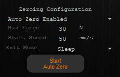

# 11 - Auto Zeroing

Auto Zero Mode puts the motor into a routine that brings the shaft to its fully retracted position until it reaches a hard stop, then sets the zero position to that location. After completing zeroing, the motor will move into the specified Exit Mode. 

Auto Zeroing can also be triggered through IrisControls, or automatically at startup by enabling the Auto Zero on Boot option. 



Before configuring AutoZero, we will open the serial port and set the motor to Sleep Mode in case errors were encountered during the motor's last run.

```./main.cpp
    Actuator motor{ "MyMotorName" };

    int serial_port = obtain_serial_port_number();

    motor.open_serial_port(serial_port);

    motor.set_mode(MotorMode::SleepMode);
```


## Configuration

### Zero Mode

1. We will set the `ZERO_MODE` register to enable Auto Zeroing, valid settings include
    1. Auto Zero Enabled (2) - Auto Zero is enabled but is started by clicking Start Auto Zero in IrisControls, or by putting the motor into AutoZeroMode
    2. Auto Zero on Boot (3) - Auto Zero is enabled and will be performed automatically on motor startup / reboot.

```./main.cpp
    ...
    const int auto_zero_enabled = 2;
    ...
    motor.write_register_blocking(ZERO_MODE, auto_zero_enabled);
    ...
```

Note: If you are working in Python, the registers will require manual definitions as shown below: 

```./main.py
    ...
    ZERO_MODE = 171
    ZERO_MODE_ENABLED = 2
    ...
    motor.write_register_blocking(ZERO_MODE, ZERO_MODE_ENABLED)
    ...
```

### Maximum Force

2. Configure the `AUTO_ZERO_FORCE_N` register to set the maximum force (in Newtons) the shaft can move during auto zeroing, or use the position page on IrisControls. 

```./main.cpp
    ...
    const int force_newtons = 30;
    ...
    motor.write_register_blocking(AUTO_ZERO_FORCE_N, force_newtons);
    ...
```

### Shaft Speed

3. Set the `AUTO_ZERO_SPEED_MMPS` to define the shaft speed (in mm / s) during Auto Zeroing. 

```./main.cpp
    ...
    const int speed_mm_per_sec = 50;
    ...
    motor.write_register_blocking(AUTO_ZERO_SPEED_MMPS, speed_mm_per_sec);
    ...
```

### Exit Mode

4. Set the `AUTO_ZERO_EXIT_MODE` register to set the exit mode. The mode can be set to one of the following:
- Sleep Mode (1)
- Force Mode (2)
- Position Mode (3)
- Haptic Mode (4)
- Kinematic Mode (5)
- Pulse Width Mode (11)

```./main.cpp
    ...
    motor.write_register_blocking(AUTO_ZERO_EXIT_MODE, MotorMode::SleepMode);
    ...
```

### Starting Auto Zeroing

5. Auto Zeroing can be started by setting the Motor mode to `AutoZeroMode`. Note: steps one to four are interchangable, but step five must occur last.

```./main.cpp
    ...
    motor.set_mode(MotorMode::AutoZeroMode);
    ...
```

### Determining Auto Zeroing is Finished

To determine if Auto Zeroing has finished:
- We can check for a change of the motor's mode. 
- If an error with value of 8192 is returned, Auto Zeroing has failed.

```./main.cpp
    ...
    while (true) {
        auto error_check = motor.get_errors();

        if (error_check.value & auto_zero_error) {
            std::cout << "\nAuto Zeroing Failed." << std::endl;
            return 0;
        }
        else if (motor.get_mode().value != MotorMode::AutoZeroMode) {
            std::cout << "\nAuto Zeroing Complete!" << std::endl;
            return 0;
        }
    }
```

Note: Successful Auto Zeroing may require a shaft collar to help provide a hard stop.

See the [ORCA Motors Reference Manual](https://irisdynamics.com/hubfs/Website/Downloads/Orca/Approved/RM220115_Orca_Series_Reference_Manual.pdf?hsCtaTracking=e63573b5-0822-49c6-ab51-8fd19e3dbc2c%7C02512cb7-0bf7-4398-bf2e-2b2ceb8a6bab) on page(s) 43-45 for further information regarding Auto Zero configuration and settings.
    


  

